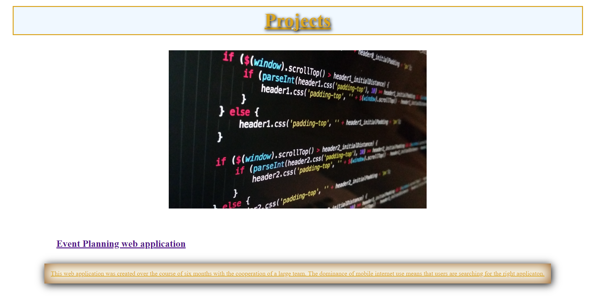

# Meet John Watson Profile

## Challenge 2 Accepted:

## Introduction:
As a junior developer I have been lucky enough to travel and experience working with great teams of individuals. This page includes examples of my main skills in fundemental HTML, CSS, and Javascript work. The website itself was designed to be responsive. 
##
The web page was built to stand out from the norm while still utilizing semantic tags and regular comments throughout the CSS stylesheet and HTML code. The largest project I took part in creating was in creating an Event Planning web application as highlighted in my Projects section.  

---
## Highlights:
The major project was taking part building a six month event planning web application.
##

##
Throughout the website you'll find links to my previous work in various roles like Email Developer, QA Tester, and front end development for a photography studio. 
## 
Overall the portfolio page was made to be responsive for a variety of screen sized while maintaining clear headings for all viewers. 
##
--- 
**Check out the web page below:**
##
[Meet John Watson Profile](https://think-again-coder.github.io/MeetJohnWatson/) 
## 
## - John Watson -
